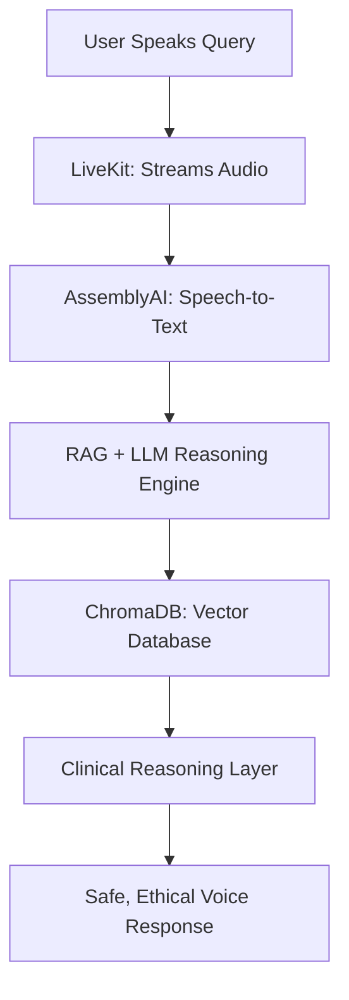

# HealthMate – A Voice Agent That *Thinks and Reasons* Before Answering for Medical Awareness and Decision Support
>           


  


---

## 🚀 What is HealthMate?

**HealthMate** is more than a voice assistant—it’s your **trusted health confidant** that *thinks and reasons like a clinician* to deliver safe, reliable medical knowledge. Designed to empower everyone, especially underserved communities, it provides instant, ethical health guidance through voice interaction, bridging gaps in health literacy and accessibility.

- 🎙️ **Voice-First Queries**: Ask health questions naturally, no typing required.
- 🧠 **Reasoned Responses**: Simulates clinical reasoning for clear, evidence-based answers.
- 🌍 **Global Impact**: Targets rural, low-literacy, and non-English-speaking users.
- 🚨 **Ethical Core**: Never diagnoses, always escalates emergencies, and refers to professionals.

> 💡 Imagine a medical mentor in your pocket—available 24/7, powered by AI, and grounded in trust.

---

## 🎯 Why HealthMate?

The world is grappling with a health information crisis:
- **3.6 billion people** lack access to basic healthcare.
- **90% of online health info** is misleading or false.
- **50% of rural areas** remain underserved, with language and literacy barriers widening the gap.
- Patients often delay care or self-medicate, risking lives.

**HealthMate’s Mission**: To democratize health literacy with *voice-first, ethical, and accessible* medical guidance, powered by AI that *thinks and reasons* before responding, ensuring safety and clarity for all.

---

## 🔗 Demos & Links

- **Live Link** → [Visit Here](https://healthmate-ai-voice-agent-frontend.vercel.app/)  
- **Demo Video** → [See Here](https://www.loom.com/share/a4025d13319b4b4d86f178c582fdf69c?sid=538a28b7-020e-4ad2-a0d8-9aeb845f872b)  
- **Frontend Repository** → [Check Here](https://github.com/Manojkumar2806/healthmate-ai-voice-agent-frontend.git)  
- **Backend Repository** → [Check Here](https://github.com/Manojkumar2806/healthmate-ai-voice-agent-backend.git)


---

---
## 📸 Screenshots & Demo Flow

|  |  |  |
|---|---|---|
| **Home / Intro** | **How it Works** | **Ethical & Safe Guards** |

|  |  |  |
|---|---|---|
| **Impact Potential** | **Voice Activation** | **AssemblyAI Transcript & LiveKit** |

|  |
|---|
| **Clinical Reasoning & Output** |

---

## ⚙️ How HealthMate Works

### 🧭 System Workflow

HealthMate’s brilliance lies in its ability to *think and reason* like a clinician, ensuring every response is safe, accurate, and helpful. Here’s the flow:



## Step-by-Step Breakdown

| Step | Component       | What It Does                                                   |
|------|------------------|----------------------------------------------------------------|
| 1    | LiveKit          | Captures, streams real-time voice from browser                |
| 2    | AssemblyAI       | Converts speech to accurate, medical-aware text               |
| 3    | RAG + LLM        | Interprets user query and retrieves clinical context          |
| 4    | ChromaDB         | Performs vector search in curated medical knowledge base      |
| 5    | Reasoning        | Simulates safe, step-wise clinical thinking                   |
| 6    | Voice Output     | Returns AI response with red flag checks and explanations     |

---

## Tech Stack 

| Tech             | Use / Magic                                                            |
|------------------|------------------------------------------------------------------------|
| LiveKit          | Realtime voice streaming (WebRTC, ~300ms latency)                      |
| AssemblyAI       | Universal-Streaming ASR tuned for accurate, medical speech input       |
| Gemini / GPT     | Interprets clinical language and logic, ensures safe RAG-based output  |
| ChromaDB         | Blazing fast vector search over reliable, curated medical data         |
| FastAPI          | Python backend that handles core logic, API routing, and security      |
| React + Tailwind | Clean, responsive, and user-friendly frontend interface                |
| Render          | Effortless cloud deployment and auto-scaling for backend services      |
| .env / Vercel    | Secures environment variables and config for safe deployment           |


---

## Core Logic: LiveKit + AssemblyAI + Gemini LLM

**Purpose**:  
Enable real-time voice streaming, detect end-of-speech (VAD), convert voice to text via AssemblyAI, and route the transcription to Gemini via FastAPI backend.

### Key Components

```python
# Set up LiveKit Voice Activity Detection + AssemblyAI
stt = assemblyai.STT(
    api_key=ASSEMBLYAI_API_KEY,
    end_of_turn_confidence_threshold=0.7,
    min_end_of_turn_silence_when_confident=160,
    max_turn_silence=2400,
)
```

```python
# Define LLM function to call FastAPI's /api/query
def webhook_llm_function(prompt: str) -> str:
    response = requests.post("http://localhost:8000/api/query", json={"query": prompt})
    return response.json().get("answer", "No answer received.")
```

```python
# LiveKit Agent Setup
llm = FunctionLLM(func=webhook_llm_function)

agent = Agent(
    name="HealthMate Voice Agent",
    session_factory=lambda: AgentSession(
        stt=stt,    # Real-time transcription
        llm=llm,    # Calls backend for Gemini response
        tts=None    # No text-to-speech (yet)
    ),
)
```
---


## Challenges Faced & How We Solved Them

| Challenge            | Description                                                                 | Solution                                                                 |
|---------------------|-----------------------------------------------------------------------------|--------------------------------------------------------------------------|
| Voice Cutoff Timing | User speech was getting cut too early or too late.                          | Tuned `end_of_turn_confidence_threshold` and silence timings in AssemblyAI. |
| Audio Sync          | Voice stream sometimes lagged between LiveKit and AssemblyAI.               | Optimized buffer settings and ensured proper threading in voice stream. |
| Slow LLM Response   | Gemini API responses created noticeable lags in conversation.               | Implemented loading states on frontend and added response caching.       |
| CORS Errors         | Frontend couldn’t connect to FastAPI backend due to CORS policy blocks.     | Used `fastapi.middleware.cors` with permissive settings during dev.      |
| API Key Leaks       | Accidentally committed `.env` with secrets.                                 | Added `.env` to `.gitignore` and rotated all leaked API keys immediately. |

-----
## 👥 Team

| **👨‍💻 Manoj Kumar Pendem**<br>[GitHub](https://github.com/Manojkumar2806) | **👨‍💻 Naveen Bathini**<br>[GitHub](https://github.com/mightynawiin) |
|--------------------------------------|--------------------------------------|
| Frontend & integration specialist, focused on creating seamless and accessible user experiences. | Prototype & architecture lead, passionate about building impactful health AI solutions. |


## 🤝 Let’s Connect!

- 🛠️ [GitHub](https://github.com/Manojkumar2806) – Explore the code, file feedback, or contribute ideas  
- 🔗 [LinkedIn](https://www.linkedin.com/in/manoj-kumar-pendem/) – Let’s connect professionally  
- 🌍 Collaborations: Open to NGOs, health orgs, and language localization partners

---

## 🚀 Conclusion

**HealthMate** isn’t just another AI project—it’s a step toward making trusted health guidance accessible to every voice, everywhere.  
Built with purpose, designed for impact. Let’s reimagine healthcare, one conversation at a time.


 **Thank you for visiting our repository!**  
We hope you found our project inspiring. Feel free to ⭐ star the repo and share your feedback!
